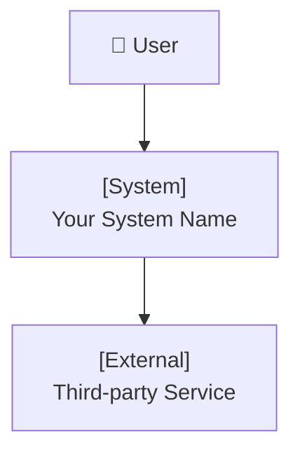
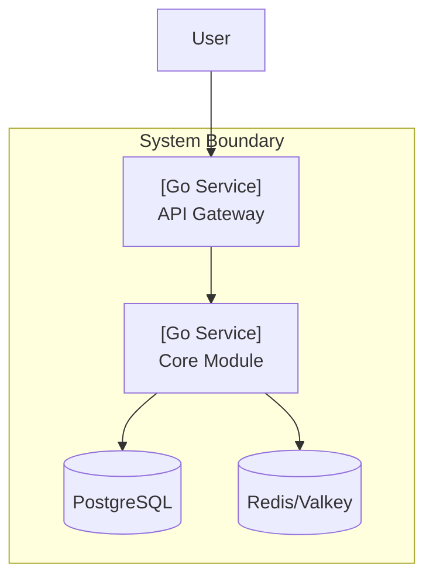
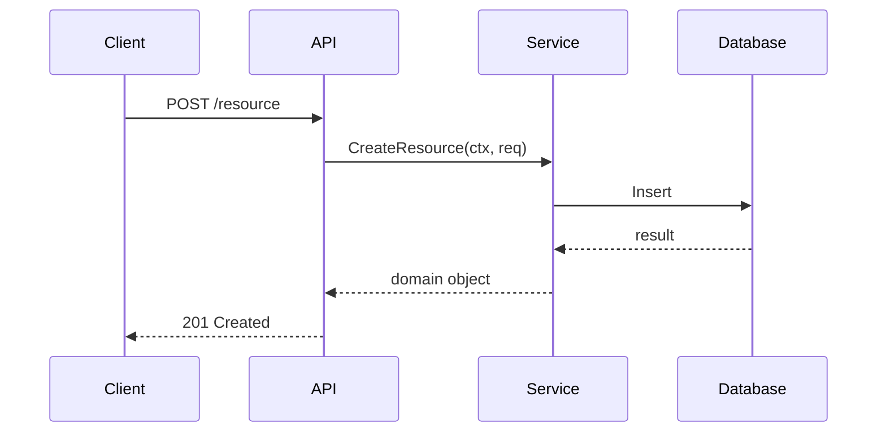
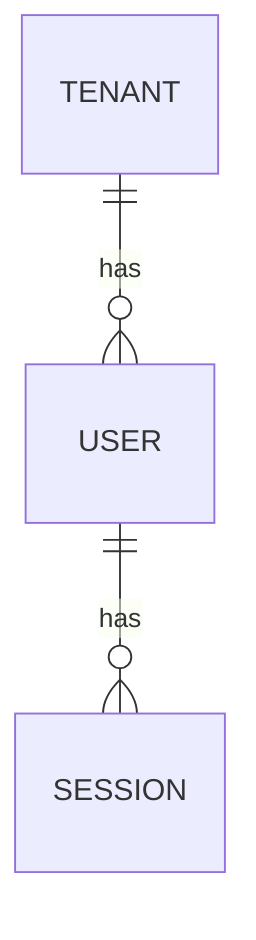
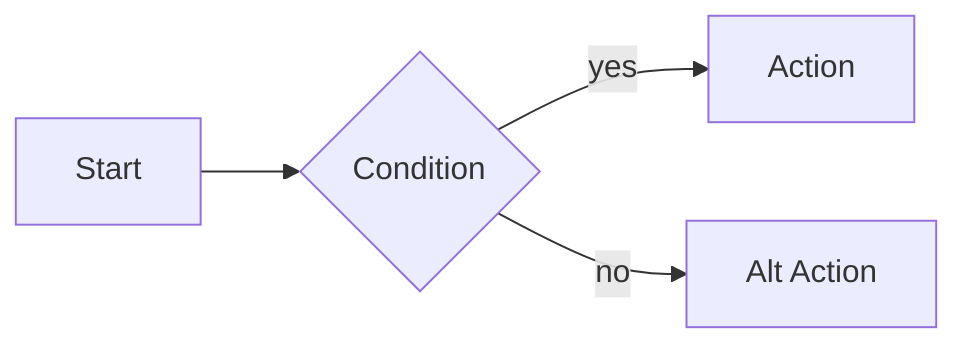

# C4 Diagram Generation

Always use **Mermaid** as default (renders in GitHub, Notion, Claude). Use **PlantUML** only when explicitly requested.

## Diagram Types

**C4 Context (Level 1)** — System boundary and external actors:

**C4 Container (Level 2)** — Internal containers/services:

**Sequence Diagram** — Key workflows:

**ERD** — Data model:

**Flowchart** — Process flows, state machines:

**Rules for diagrams:**
- Always add a title and brief description above each diagram
- Keep diagrams focused — one diagram per concept, max ~15 nodes
- Use consistent naming with the rest of the design doc
- For multi-tenant systems, always show tenant isolation boundary