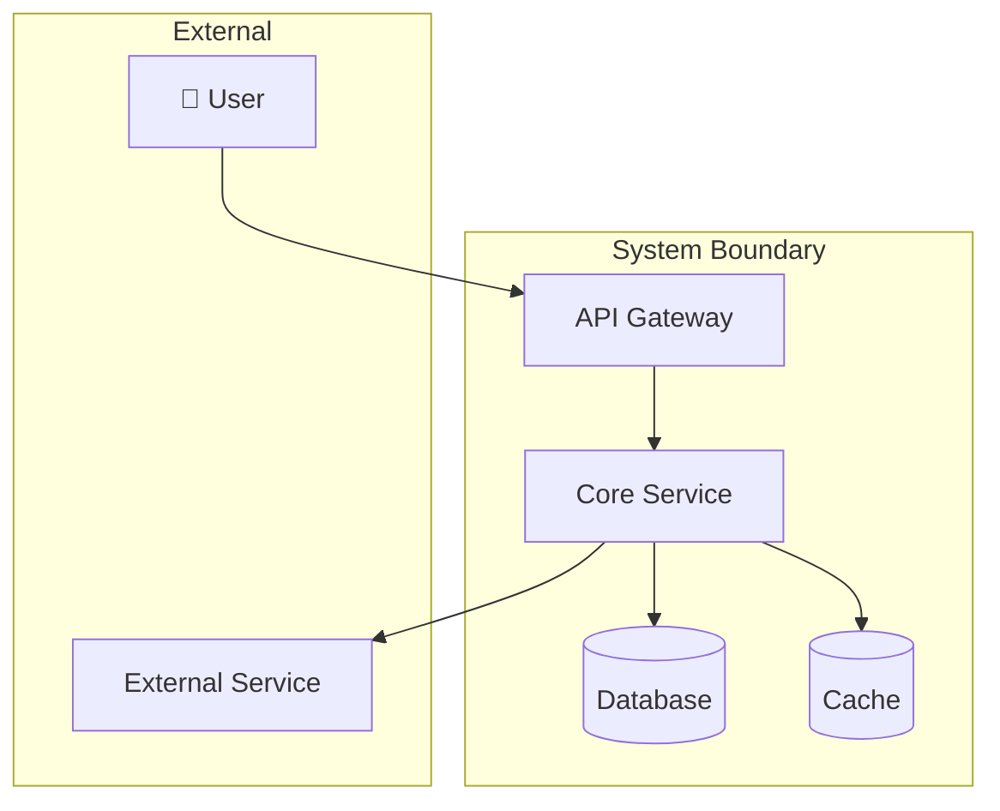
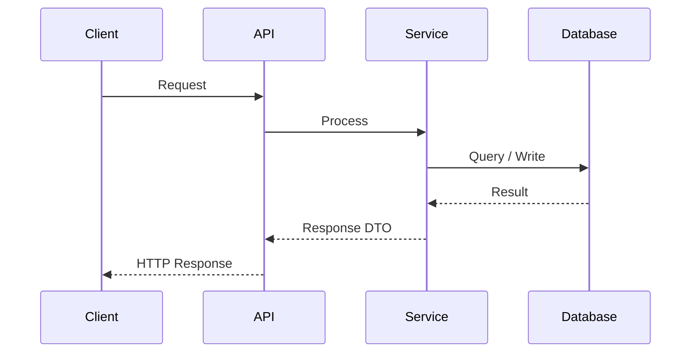
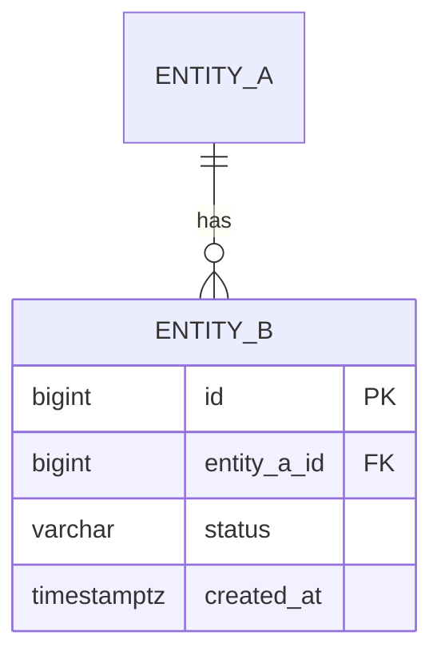
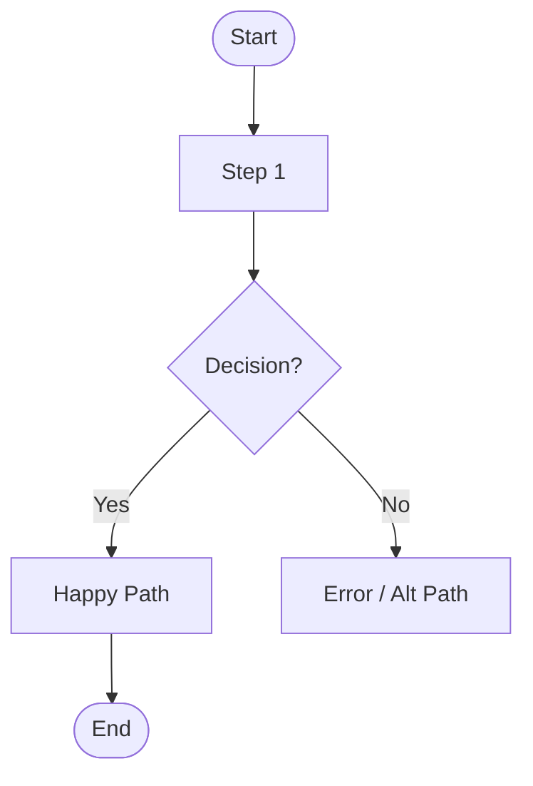
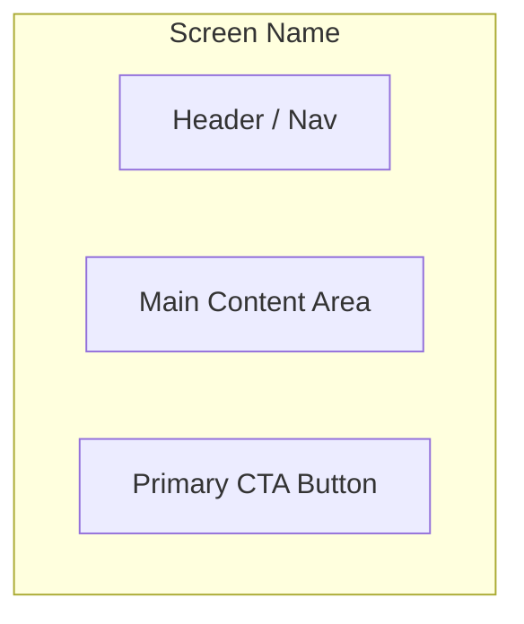

# PRD — [Product / Feature Name]

**Version:** 1.0
**Status:** Draft | In Review | Approved
**Author:** [Name]
**Last Updated:** YYYY-MM-DD
**Stakeholders:** [PM, Engineering Lead, Design, QA, Legal, ...]

---

## 1. Overview / Context

### 1.1 Problem Statement

> _One clear sentence. What pain, inefficiency, or opportunity does this address? Who feels it?_

[e.g., "Warehouse operators lose ~2 hours/day manually reconciling shipment discrepancies because the current
system does not surface mis-matches in real time."]

### 1.2 Background / Context

> _Why now? What triggered this work? Reference incidents, strategic decisions, or prior research._

-
-

### 1.3 Goals

> _2–5 concrete, measurable outcomes. Use "We will achieve X by Y."_

| # | Goal | Metric | Target |
| - | ---- | ------ | ------ |
| G-01 | | | |
| G-02 | | | |
| G-03 | | | |

### 1.4 Non-Goals

> _Explicit scope exclusions. If it sounds in scope but isn't, list it here._

- This project will **not** address [X].
- Out of scope: [Y].

---

## 2. Objectives & Success Metrics

### 2.1 KPIs / OKRs

| Objective | Key Result | Current Baseline | Target |
| --------- | ---------- | ---------------- | ------ |
| | | | |

### 2.2 Acceptance Criteria (High-Level)

> _Minimum bar for shipping. Product-level definitions of done — not test cases._

- [ ] AC-01:
- [ ] AC-02:
- [ ] AC-03:

### 2.3 Business Impact

> _Revenue, cost savings, user retention, risk reduction. Quantify where possible._

-

---

## 3. Users & Use Cases

### 3.1 User Personas

| Persona | Role | Technical Level | Primary Motivation | Pain Today |
| ------- | ---- | --------------- | ------------------ | ---------- |
| [Name] | | Novice / Intermediate / Expert | | |

### 3.2 Key User Journeys

#### Journey 1 — [Name, e.g., "Place an Order"]

1. User [action]
2. System [response]
3. User [action]
4. ...

**Success state:** [What the user has achieved]
**Failure/edge state:** [What happens if X goes wrong]

#### Journey 2 — [Name]

1.
2.

### 3.3 Pain Points

> _What is broken or missing today? Ground in evidence where possible._

- [Pain point 1] — Source: [user research / support tickets / analytics]
- [Pain point 2]

---

## 4. Functional Requirements

> Format: `FR-XX: The system **must/shall** [do X] when [condition].`
> Add edge cases inline. User stories are optional — include only if requested.

| ID | Requirement | Priority | Notes / Edge Cases |
| -- | ----------- | -------- | ------------------ |
| FR-01 | The system **must** ... | Must-have | |
| FR-02 | The system **must** ... | Must-have | |
| FR-03 | The system **should** ... | Should-have | |
| FR-04 | The system **may** ... | Nice-to-have | |

### Priority Legend

- **Must-have**: Required for launch. Blocking if absent.
- **Should-have**: High value; include if time permits.
- **Nice-to-have**: Low priority; defer to a future phase.

---

## 5. Non-Functional Requirements

### 5.1 Performance

| Metric | Target | Notes |
| ------ | ------ | ----- |
| API response time (p99) | < Xms | Under Y RPS load |
| Page load time | < Xs | Core Web Vitals |
| Throughput | X req/s | Peak traffic estimate |

### 5.2 Scalability

- Expected users at launch: [N]
- Expected users at 12 months: [N]
- Expected load at peak: [N req/s]
- Horizontal scaling: [Yes / No / Stateless services only]

### 5.3 Security

- Authentication: [OAuth 2.0 / JWT / API Key / Session]
- Authorization: [RBAC / ABAC / Scoped tokens]
- Data classification: [Public / Internal / Confidential / Restricted]
- Encryption at rest: [Yes / No / AES-256]
- Encryption in transit: [TLS 1.2+ required]
- Sensitive data: [PII / PHI / PCI — list fields]

### 5.4 Reliability

| SLA | Target |
| --- | ------ |
| Uptime | 99.X% |
| RTO (Recovery Time Objective) | < X hours |
| RPO (Recovery Point Objective) | < X minutes |

- Failure modes: [What happens when X fails?]
- Graceful degradation: [What is the fallback?]

### 5.5 Compliance & Regulatory

- [ ] GDPR
- [ ] HIPAA
- [ ] SOC 2 Type II
- [ ] PCI DSS
- [ ] Other: [specify]

---

## 6. Solution / Design _(Optional)_

### 6.1 Architecture Overview

> _High-level system design. Replace the placeholder diagram below._

### 6.2 Data Flow / Key Sequences

> _Show the most critical request/response flow._

### 6.3 Data Model

> _Key entities and relationships._

### 6.4 User Flow _(if user-facing)_

### 6.5 API Contract _(if applicable)_

> _List key endpoints with request/response shapes._

| Method | Endpoint | Request Body | Response | Auth |
| ------ | -------- | ------------ | -------- | ---- |
| POST | `/v1/[resource]` | `{ ... }` | `201 { id, ... }` | Bearer |
| GET | `/v1/[resource]/:id` | — | `200 { ... }` | Bearer |
| PATCH | `/v1/[resource]/:id` | `{ ... }` | `200 { ... }` | Bearer |
| DELETE | `/v1/[resource]/:id` | — | `204` | Bearer |

### 6.6 UI/UX References _(if frontend involved)_

> _Wireframe sketch or reference to design files._

---

## 7. Dependencies & Risks

### 7.1 External Dependencies

| Dependency | Owner / Team | Type | Required By |
| ---------- | ------------ | ---- | ----------- |
| | | API / SDK / Data / Team | |

### 7.2 Assumptions

> _If any assumption is wrong, this design may need to change._

- Assumption 1: [We assume X is true because Y]
- Assumption 2:

### 7.3 Risks & Mitigations

| Risk | Likelihood | Impact | Mitigation |
| ---- | ---------- | ------ | ---------- |
| | High / Med / Low | High / Med / Low | |

---

## 8. Timeline & Milestones

| Phase | Milestone | Target Date | Deliverable | Owner | Depends On |
| ----- | --------- | ----------- | ----------- | ----- | ---------- |
| Phase 1 — MVP | | YYYY-MM-DD | | | |
| Phase 2 — Hardening | | YYYY-MM-DD | | | Phase 1 |
| Phase 3 — Scale | | YYYY-MM-DD | | | Phase 2 |

---

## Open Questions

> _Unresolved decisions that must be answered before development begins._

- [ ] OQ-01: [Question] — Owner: [Name] — Due: YYYY-MM-DD
- [ ] OQ-02:

---

## Revision History

| Version | Date | Author | Changes |
| ------- | ---- | ------ | ------- |
| 1.0 | YYYY-MM-DD | | Initial draft |
